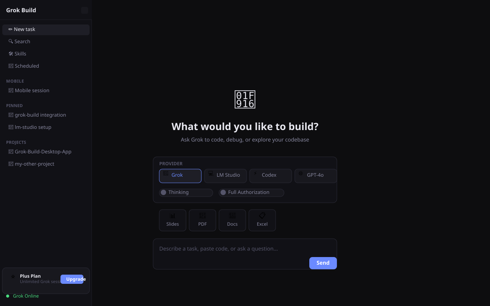

# Grok Build Desktop App

> A local-first AI coding desktop app powered by xAI's Grok Build CLI — with first-class LM Studio and Codex support.



---

## ⚡ Features

- **Multiple AI Providers** — Grok (xAI), LM Studio (local), OpenAI Codex, GPT-4o
- **Local-First** — Run LLMs entirely offline via LM Studio on your local network
- **Grok CLI Sidecar** — xAI's Rust-based agent runtime with ACP protocol, sandboxing, and MCP support
- **Dark Theme UI** — Clean, focused UI with sidebar navigation, model picker, and file attachers
- **Plan/Build Mode** — Draft implementation plans before executing (inspired by OpenChamber)
- **Cross-Device Sessions** — Sessions persist and can be resumed (via OpenChamber pattern)
- **Skills & Hooks** — Grok's built-in skill system + local skill management
- **Electron + SolidJS** — Fast, lightweight desktop app using proven opencode architecture

---

## 🚀 Quick Start

```bash
# Clone
git clone https://github.com/Franzferdinan51/Grok-Build-Desktop-App.git
cd Grok-Build-Desktop-App

# Install
pnpm install

# Install Grok CLI (if not present)
curl -fsSL https://x.ai/cli/install.sh | bash

# Run dev server
pnpm dev
```

See [docs/INSTALL.md](./docs/INSTALL.md) for full setup instructions.

---

## 📦 Providers

| Provider | Type | Tool Calls | Local |
|----------|------|------------|-------|
| **Grok (xAI)** | Cloud | ✅ | ❌ |
| **LM Studio** | Local | ❌ | ✅ |
| **Codex (OpenAI)** | Cloud | ✅ | ❌ |
| **GPT-4o (OpenAI)** | Cloud | ✅ | ❌ |

See [docs/PROVIDERS.md](./docs/PROVIDERS.md) for configuration details.

---

## 📚 Documentation

| Doc | Description |
|-----|-------------|
| [ARCHITECTURE.md](./docs/ARCHITECTURE.md) | System design, stack decision, IPC map |
| [PROVIDERS.md](./docs/PROVIDERS.md) | Provider configs, auth setup, API snippets |
| [FEATURES-INSPO.md](./docs/FEATURES-INSPO.md) | Feature matrix with source citations (35 rows) |
| [INSTALL.md](./docs/INSTALL.md) | Dev setup, grok CLI install, LM Studio setup |
| [CONTRIBUTING.md](./docs/CONTRIBUTING.md) | PR process, style guide, area guide |

---

## 🏗️ Architecture

```
Electron Main Process          Grok CLI (Rust)
┌──────────────────────┐       ┌──────────────────────┐
│  Window Mgmt         │       │  grok --headless      │
│  IPC Handlers        │◄─────►│  --stdio (JSON-RPC)   │
│  Grok Sidecar Manager │       └──────────────────────┘
│  electron-store       │
└──────────────────────┘
         ▲
         │ contextBridge (secure IPC)
         ▼
┌──────────────────────┐
│  SolidJS Renderer    │
│  ┌────────────────┐ │
│  │ Sidebar        │ │
│  │ Empty State    │ │
│  │ Model Picker   │ │
│  │ Provider Layer │ │
│  └────────────────┘ │
└──────────────────────┘
```

Stack: **Electron + SolidJS + electron-vite** (mirrors opencode v2)

See [docs/ARCHITECTURE.md](./docs/ARCHITECTURE.md) for full details.

---

## 🔗 Links

- **GitHub Repo**: https://github.com/Franzferdinan51/Grok-Build-Desktop-App
- **Grok CLI**: https://github.com/xai-org/grok-build
- **Fork**: https://github.com/Franzferdinan51/grok-build
- **Grok Docs**: https://docs.x.ai/build/overview

---

## 🛡️ Reference Sources

This project draws from:

- [sst/opencode](https://github.com/sst/opencode) — Electron + SolidJS + electron-vite pattern, AGENTS.md style
- [openchamber/openchamber](https://github.com/openchamber/openchamber) — Plan/build mode, skills, multi-agent, branchable timeline
- [sourcegraph/cody-public-snapshot](https://github.com/sourcegraph/cody-public-snapshot) — Codebase context architecture
- [openclaw/openclaw](https://github.com/openclaw/openclaw) — Tray + node mode, gateway as control plane
- [xai-org/grok-build](https://github.com/xai-org/grok-build) — Rust CLI with ACP, headless, MCP, sandboxing

See [docs/FEATURES-INSPO.md](./docs/FEATURES-INSPO.md) for the full 35-row citation table.

---

## 📄 License

MIT
